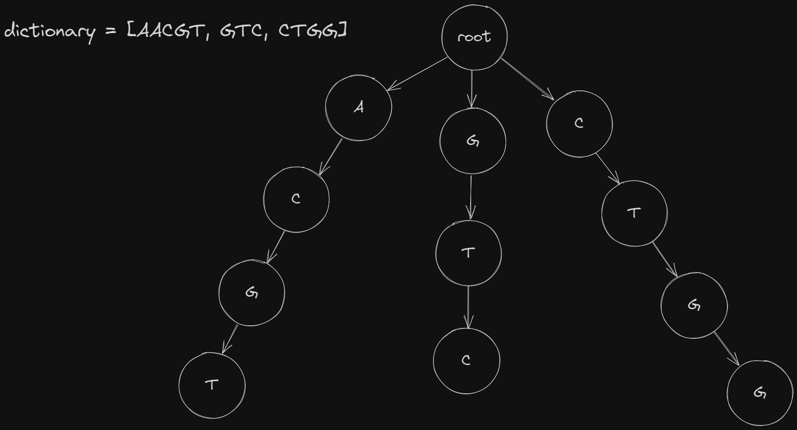
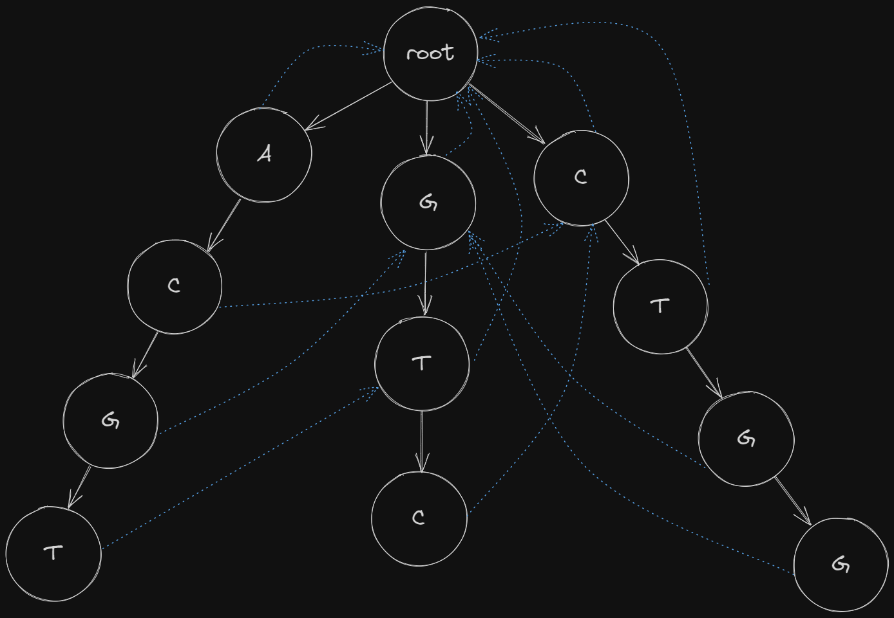

# Efficient string matching using Aho-Corasick Automaton
Hi, I am here to introduce you to an awesome algorithm that enables you to efficiently find string matches given a group of patterns and a long string. For example, imagine you want to know if a certain group of genes exists in a certain specie. A DNA storage file of a specie can be around 1 Gb large. It is very tedious to manually search for a particular gene in such a large DNA string! Not to mention, we have a group of genes that we want to search! But do not worry, we have an algorithm that will save you the tedious task and as a bonus, this algorithm is pretty fast!

## String matching using Tries
First, let met tell you what are Tries. Trie is a tree data structure that is used to store and locate keys from a set. In our usecase, the keys pertain to strings/patterns and the set pertains to a dictionary of strings/patterns. Below is an illustration of a trie from a dictionary containing three patterns.



Coding a trie can be daunting but it is pretty simple if you practice! For each node, we usually define two attributes. First, we define the `children` attribute, which lets us access the children of the node. Second, the `is_end` boolean attribute. This will let us know if the we have found a pattern! We can also add a `word` attribute to get the specific pattern we found. Below is a sample implementation.

```python
from collections import defaultdict


class TrieNode:
    def __init__(self):
        self.children = defaultdict(TrieNode)
        self.word = ""
        self.is_end = False


class Trie:
    def __init__(self, dictionary: List[str]):
        self.root = TrieNode()
        for string in dictionary:
            curr = self.root
            for letter in string:
                if letter not in curr.children:
                    curr.children[letter] = TrieNode()
                curr = curr.children[letter]
            curr.is_end = True
            curr.word = string
```

Now that we have a Trie constructed from our group of patterns, we can know do some queries. Imagine that we have a long string, and we want to find if patterns from our dictionary are present in that long string. We will have to go through the string and simultaneously traverse the trie.

```python
def find_matches(long_string: str, dictionary: List[str]):
    trie = Trie(dictionary)

    n = len(long_string)
    matches = []
    for i in range(n):
        curr = trie.root
        for j in range(i, n):
            letter = long_string[j]
            if letter not in curr.children:
                break
            curr = curr.children[letter]
            if curr.is_end:
                matches.append(curr.word)
    return matches
```

This solution runs in $O(n^2)$ time, where $n$ is equal to the length of the long string. While this is a good solution, this runs really slow when we are faced with a gigaton size of long string. What should we do then? We don't give up! We use the Aho-Corasick Automaton!

## Aho-Corasick Automaton
This algorithm also uses a Trie as a foundation, but with additional bookkeeping. In the trie nodes, we connect fail links. By using fail links, we pass through our long string only once, making our query time $O(n)$.

### Fail links
To create fail links of a node, we look at the node's parent:
* If the parent is root, we point the fail link of the node to the root.
* Otherwise, we look at the parent's fail link and see if there are children with the same values as our node, otherwise, continue traversing the fail links.

I know it is confusing, but maybe you can clear your doubts when we see the code. We do breadth-first-search traversal of the Trie and connect the fail links for each node. With that, we will need to modify our `TrieNode` implementation.

```python
class TrieNode:
    def __init__(self):
        self.children = defaultdict(TrieNode)
        self.output = set()
        self.fail = None
```

Now for the Aho-Corasick Automaton!
```python
class AhoCorasick:
    def __init__(self, dictionary: List[str]):
        self.root = TrieNode()
        self.build_trie(dictionary)
        self.build_fail()

    def build_trie(self, dictionary: List[str]):
        for string in dictionary:
            curr = self.root
            for letter in string:
                if letter not in curr.children:
                    curr.children[letter] = TrieNode()
                curr = curr.children[letter]
            curr.output.add(string)
    
    def build_fail(self):
        q = deque([self.root])
        while q:
            curr_node = q.popleft()
            for n, child in list(curr_node.children.items()):
                if curr_node is self.root:
                    child.fail = curr_node
                else:
                    p = curr_node.fail
                    while p is not self.root or n not in p.children:
                        p = p.fail
                    if n in p.children:
                        p = p.children[n]
                    child.fail = p
                    child.output.update(p.output)
                q.append(child)
```

After creating the Automaton, our previous trie would look like this with the fail links!


Now, we can find matches in linear time!
```python
def find_matches(long_string: str, dictionary: List[str]):
    ac = AhoCorasick(dictionary)

    n = len(long_string)
    curr = ac.root
    matches = []
    for i in range(n):
        letter = long_string[i]
    
        while curr is not ac.root and letter not in curr.children:
            curr = curr.fail
        if letter in curr.children:
            curr = curr.children[letter]
        
        for match in curr.output:
            matches.append(match)
    return matches
```

## Conclusion
* We learned how to make a simple Trie and do a string search with it!
* We learned how to build an Aho-Corasick Automaton and optimize our string search!

Thank you for reading! I hope it was useful. If you have any questions or found any mistakes, please submit an issue/PR! Until next time!